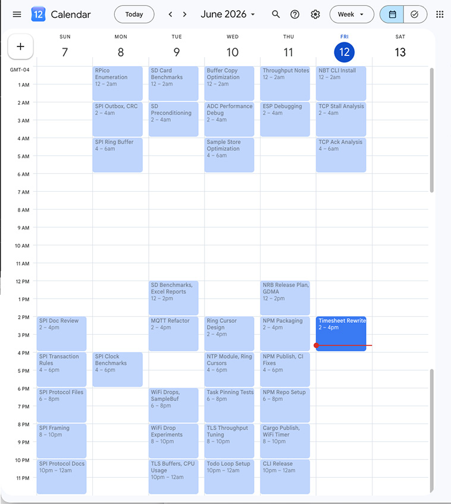

# Claude Code Timesheet Loop → Google Calendar

Keep an eye on what Claude Code does (what you spend your time and money on)



## Implementation

Two thin Python tools wrapping a model-in-the-loop. The model (Claude, running
in your `/loop`) is the aggregation engine: it reads the changed slots, writes
the ≤3-word headlines, and calls sync. The Python is deterministic plumbing.

```
extract.py  →  [model writes headlines]  →  sync.py
 (input)          (the loop body)           (output + cache commit)
```

## What each piece does

- **extract.py** — globs Claude Code transcripts (`*.jsonl` under
  `~/.claude/projects` by default), keeps only **your prompts** and **session
  titles** (not Claude's narration, not tool results), buckets them into
  2-hour LOCAL-time slots, diffs against the last committed snapshot, and
  prints only changed slots. The full snapshot goes to
  `raw.pending.json` — it does NOT travel through the model.
- **model** — reads the delta, writes/refines headlines (≤3 words per thread
  of work, comma-joined per slot), emits `{"headlines": {slot: "Title", ...}}`.
  Nothing else.
- **sync.py** — upserts a 2-hour event per slot on the "Claude Code" calendar,
  matching existing events BY TIME WINDOW, touching ONLY events it created
  (marker `extendedProperties.private.claudecode=1`). On success it promotes
  `raw.pending.json` → `raw.json` and merges `headlines.json`. A failed push
  commits nothing, so the delta survives to the next run.

## One-time setup

1. Install the Google client into a dedicated venv (plain `pip install` fails
   on Homebrew/PEP 668 Pythons):
   ```bash
   python3 -m venv ~/.cache/claude-cal/venv
   ~/.cache/claude-cal/venv/bin/pip install \
       google-api-python-client google-auth-httplib2 google-auth-oauthlib
   ```
2. Create an OAuth **Desktop** client in Google Cloud Console, enable the
   Calendar API, download the client secret JSON to
   `~/.cache/claude-cal/credentials.json`.
3. First sync run opens a browser OAuth consent; the token is cached at
   `~/.cache/claude-cal/token.json` and auto-refreshed (a revoked token falls
   back to the browser flow).

extract.py has no dependencies; system `python3` runs it.

## The loop

Start a Claude Code session in this repo and paste this (`/loop` with an
interval, e.g. every 60 minutes):

```
/loop 60m Run `python3 extract.py --exclude claude-timesheet-loop` and read
the JSON it prints. If "slots" is empty, say "no activity" and stop this
iteration. Otherwise, for each slot, write one headline per distinct thread of
work — each headline at most 3 words, Title Case, based on that slot's
"prompts" and "titles" — and comma-join them into the slot's value, like
"OAuth Authentication, Calendar Sync"; if
"existing_headline" is set, refine it rather than replacing it wholesale; for
a slot with "vanished": true, map it to "" to clear its event (or omit the
slot to keep the event). Then pipe exactly
{"headlines": {"<slot>": "<headline>", ...}} to
`~/.cache/claude-cal/venv/bin/python3 sync.py --create-calendar` and report
its stderr counts. Run extract, headlines, sync strictly in that order, once
per iteration — never run extract a second time before sync has pushed.
```

On the very first iteration, add `--dry-run` to the sync command and inspect
the planned ops before letting it write.

The three-stage order matters: sync promotes whatever snapshot extract last
wrote, so a second extract between a delta and its push would commit
activity the model never saw.

### Model rules for headlines
- One headline per distinct thread of work; ≤3 words *per headline*. Title Case.
- A slot's event title is the comma-join of its headlines:
  `"OAuth Authentication, Calendar Sync"` is two 2-word headlines.
- Prefer editing the existing headline so titles stay stable across the live
  2-hour slot as new prompts arrive. Overwriting is fine and expected.
- `""` deletes the tool's own event in that slot; omitting a slot leaves it
  untouched. Identical headline = no API write (no churn from the live slot).

## Delta format (extract → model)

```json
{
  "slots": {
    "2026-06-12T14:00:00-04:00": {
      "prompts": ["fix oauth refresh fallback", "..."],
      "titles": ["Calendar Sync Loop"],
      "existing_headline": "OAuth, Calendar Sync"
    },
    "2026-06-10T10:00:00-04:00": {
      "prompts": [], "titles": [], "vanished": true,
      "existing_headline": "Old Experiment"
    }
  }
}
```

## Cache files (`~/.cache/claude-cal/`)
- `raw.pending.json` — current in-horizon snapshot, written by extract every run.
- `raw.json` — last committed snapshot (diff basis). Promoted from pending by
  sync on success.
- `headlines.json` — last pushed headline per slot. Written by sync on success.
- `credentials.json` / `token.json` — OAuth. `venv/` — the Google client.

## Backfill and the diff horizon (`--horizon-days`, default 14)

One argument controls both how far back the tool looks and how far back it
backfills. On a cold cache (no committed `raw.json`) every slot within the
horizon counts as changed, so the first iteration fills in the last two weeks
of calendar in one go. Deepening works at any time, not just on a cold start:
the snapshot only tracks in-horizon slots, so a one-off
`python3 extract.py --horizon-days 30` re-surfaces the older slots as new and
the loop pushes them (bounded by how long your transcripts survive, see
below). Day to day, the horizon is just the diff window for incremental
updates.

Why it's bounded at all: Claude Code prunes old transcripts
(`cleanupPeriodDays`, ~30 days). Without a horizon, every aged-out transcript
would make its slots look deleted and the loop would clear months-old calendar
events. So only slots newer than the horizon participate in the diff — older
calendar events are frozen history. Keep the horizon comfortably below your
`cleanupPeriodDays`.

## Notes
- **DST**: timestamps are converted with their own per-instant UTC offset, so
  slots land on the right wall-clock hour across DST changes. During the
  fall-back hour two distinct slot keys overlap in real time; the exact
  start-instant match in sync keeps their events separate.
- **Foreign events** in a slot window are never edited or deleted; the tool
  only ever touches events carrying its private marker.
- `--dry-run` authenticates and reads the calendar, printing the exact planned
  op per slot (`insert`/`patch`/`delete`/`skip-identical`/`skip-no-event`)
  without writing or committing anything.
